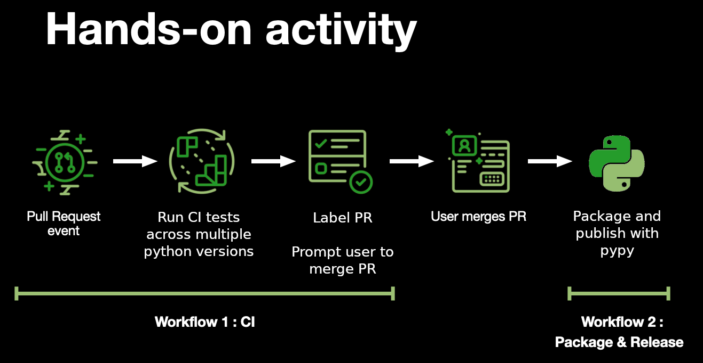

# Automate Your Workflows with GitHub Actions

:bookmark: The following instructions will take on the assumption that you will be completing the steps on the GitHub UI. Feel free to use the terminal or any other GUIs you are comfortable with.


Summary:

# Workflow 1: Steps to set up CI workflow

## Create a repository

1. Log into your GitHub account and create a new repository

    - Give it a **name**, e.g. `my-first-github-action`, and a **description**
    - It does not matter if you set the visiblity to **Private** or **Public**
    - Select `Add a README file`
    - Click `Create repository`

## Set up `python` project files

:bulb: For the purpose of this exercise, we will be committing directly to your default branch (e.g. **main**) so you don't need to create a new branch beforehand

1. Add this file to the root of your repository `pyproject.toml` and add your code in `src/example/simple.py`:

    - You can create the project files manually and copy the content into each;
      - `pyproject.toml`: Contains your python project meta data

        <details>
        <summary><b>Click here to view file contents to copy:</b></summary>
        </br>
        :bulb: <b>Replace the placeholders OWNER with your GitHub handle or organization name (if you created the repository in an organization), and REPOSITORY_NAME.</b>
        </br>


        ```toml
        [project]
        # Project name for pypi
        # $ pip install gh_action_gdsc_OWNER
        name = "gh_action_gdsc_OWNER"  # Required
        version = "1.0.3"  # Required
        description = "A sample python github action project from GDSC EPITA"  # Optional        
        readme = "README.md" # Optional
        requires-python = ">=3.7"
        license = {file = "LICENSE.txt"}
        keywords = ["github-action", "tutorial", "GDSC", "GDSC EPITA"]  # Optional
        authors = [
          {name = "GDSC EPITA", email = "author@example.com" } # Optional
        ]

        [project.optional-dependencies] # Optional
        dev = ["check-manifest"]
        test = ["coverage"]

        [project.urls]  # Optional
        "Homepage" = "https://gdsc.community.dev/epita/"
        "Bug Reports" = "https://github.com/OWNER/REPOSITORY_NAME/issues"
        "Source" = "https://github.com/OWNER/REPOSITORY_NAME/"

        # The following would provide a command line executable called `example`
        # which executes the function `main` from this package when invoked.
        [project.scripts]  # Optional
        example = "example:main"

        [tool.setuptools]
        package-data = {"example" = ["*.dat"]}

        [build-system]
        requires = ["setuptools>=43.0.0", "wheel"]
        build-backend = "setuptools.build_meta"
        ```
        </details>
      - `tox.ini`: Contains your python test meta data

        <details>
        <summary><b>Click here to view file contents to copy:</b></summary>
        </br>

        ```ini  
        [tox]
        envlist = py{37,38,39,310}
        # Minimal tox version required to run
        minversion = 3.3.0
        isolated_build = true

        [testenv]
        deps =
            check-manifest >= 0.42
            # If your project uses README.rst, uncomment the following:
            # readme_renderer
            flake8
            pytest
            build
            twine
        commands =
            check-manifest --ignore 'tox.ini,tests/**'
            python -m build
            python -m twine check dist/*
            flake8 .
            py.test tests {posargs}

        [flake8]
        exclude = .tox,*.egg,build,data
        select = E,W,F
        ```
        </details>
        
      - `src/example/simple.py`: Your source code
        <details>
        <summary><b>Click here to view file contents to copy:</b></summary>
        </br>

        ```python
        def say(line):
            return line
        ```
        </details>
      
      - `tests/test_simple.py`: Your test code
        <details>
        <summary><b>Click here to view file contents to copy:</b></summary>
        </br>

        ```python
        import unittest
        from example.simple import say


        class TestSimple(unittest.TestCase):
            def test_say(self):
                self.assertEqual(say("Hello"), "Hello")
        ```
        </details>
    
    - Make sure your changes are committed to your default branch before proceeding

## Add a CI Workflow

1. Create the following file to the default branch:

    - `.github/workflows/ci.yml`
      - This will be the workflow file taking care of building and testing your source code
      - The file content will be empty for now

1. After the above steps are finished, you should have the following files in your repository;
    - `pyproject.toml`
    - `tox.ini`
    - `src/example/simple.py`
    - `tests/test_simple.py`
    - `.github/workflows/ci.yml`

1. :tada: If everything looks fine so far, it's time to start creating our CI workflow!

1. Go to `.github/workflows/ci.yml` and enter edit mode by clicking the pencil :pencil: icon
        <details>
        <summary><b>Click here to view file contents to copy:</b></summary>
        </br>

      ```yaml
      # This workflow will run CI on your codebase, label your PR, and comment on the result

      name: Test Label and Comment

      on:
        pull_request: # the workflow will trigger on every pull request event

      jobs:
        build:
          runs-on: ubuntu-latest

          strategy:
            matrix:
              python: ['3.9', '3.10'] # matrix for building and testing your code across multiple node versions

          steps:
            - name: Checkout
              uses: actions/checkout@v2
            - name: Set up Python ${{ matrix.python }}
              uses: actions/setup-python@v3
              with:
                  python-version: ${{ matrix.python }}
            - name: Install test dependencies
              run: python -m pip install -U tox
            - name: Test
              run: python -m tox -e py

        label:
          runs-on: ubuntu-latest

          needs: build #this ensures that we only trigger the label job if ci is successful

          steps:
            - name: Checkout
              uses: actions/checkout@v2
            - uses: actions/github-script@v3
              with:
                github-token: ${{ secrets.GITHUB_TOKEN }}
                script: |
                  github.issues.addLabels({
                    issue_number: context.issue.number,
                    owner: context.repo.owner,
                    repo: context.repo.repo,
                    labels: ['release']
                  })

        comment:
          runs-on: ubuntu-latest

          needs: [build, label]

          steps:
            - name: Checkout
              uses: actions/checkout@v2
            - name: Comment on the result
              uses: actions/github-script@v3
              with:
                github-token: ${{ secrets.GITHUB_TOKEN }}
                script: |
                  github.issues.createComment({
                    issue_number: context.issue.number,
                    owner: context.repo.owner,
                    repo: context.repo.repo,
                    body: `
                    Great job **@${context.payload.sender.login}**! Your CI passed, and the PR has been automatically labelled.

                    Once ready, we will merge this PR to trigger the next part of the automation :rocket:
                    `
                  })
      ```
      </details>

- :warning: `yaml` syntax relies on indentation, please make sure that this is not changed
- Update the name of your workflow
- Within the `comment` job, you can edit the body of the comment as you see fit
- Commit the changes to your default branch

- **Knowledge Check**

  - How many jobs are there in the workflow?
    <details><summary><b>Answer</b></summary>
    The workflow contains three jobs:

    - a build-job,
    - a label-job,
    - a comment-job
  </details>

  - What is the event that will trigger this workflow?
    <details><summary><b>Answer</b></summary>
    The workflow is triggered by any pull request events.
    </details>

  - Does this workflow use a build matrix?
    <details><summary><b>Answer</b></summary>
    Yes, this workflow will build and test across multiple python versions.
    </details>

:tada: Awesome, now our CI workflow should be complete!
## Modify the Github actions permissions  
Set the workflow permissions to write otherwise you will get an error message in the next step  
**Settings -> Actions -> General:**

```Workflow permissions

Choose the default permissions granted to the GITHUB_TOKEN when running workflows in this repository. You can specify more granular permissions in the workflow using YAML.
x Workflows have read and write permissions in the repository for all scopes.
```
Don't forget to click **save**
## Test the CI Workflow

1. To test our CI workflow, we need to trigger it. And the event that triggers it is `pull_request`. So let's create a pull request to get this workflow running

1. Go to your `README.md` file and enter edit mode

1. Make some changes/add some text

1. Commit your changes to a new branch e.g. `update-readme` and click **Commit changes**

1. In the pull request, leave the title and the body to default and click **Create pull request**

1. In your PR, click on the **Checks** tab
    - You should now see your workflow kicking off, and executing all the steps defined in `.github/workflows/ci.yml`

1. After the workflow has completed, check that the following is true in your PR;
    - A label `release` has been added
    - A comment is added to the PR with the text corresponding to what you defined in the `comment` job inside `.github/workflows/ci.yml`

1. If your workflow fails, inspect the log output:
    - Which job failed?
    - Did you update your `pyproject.toml` file correctly?
    - Does the log indicate any syntax errors with your CI workflow file?

:warning: Do not merge your pull request just yet! There's more to do.

## [Click here to get started with Workflow 2](./workshop_instruction2.md)
